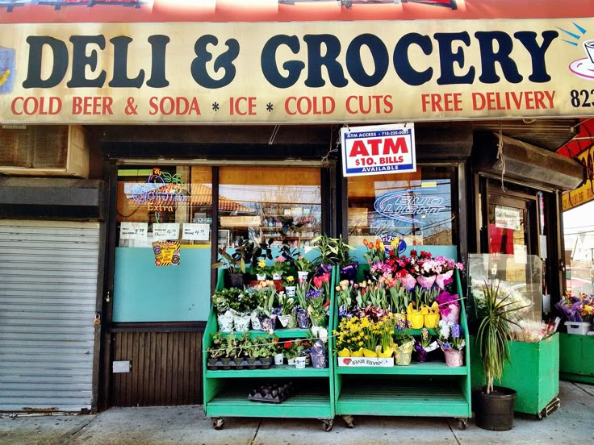
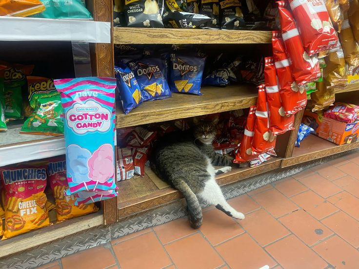

# Deli-cious
A java command-line point-of-sale (POS) application for a custom sandwich shop-built using all 4 pillars of OOP (object-oriented programming). 

Customers can customize sandwiches, add drinks and chips, review orders, and generate receipts.

## Features

- Build Custom Sandwiches.
- Sizes: 4", 8", 12"
- Bread choices: white, wheat, rye, wrap, bagel, croissant.
- Add meats, cheeses, regular toppings, sauces.
- Extra meats, cheeses charged based on size.
- Toasted option.

- Add Drinks (small, medium, large)
- Add Chips (user-defined flavors)
- Checkout: Displays total and write receipt to 'receipt.csv'
- Cancel Order (inside checkout)

-----

## Object-Oriented Principles

| OOP Principle  | Implementation Example                                  |
|----------------|---------------------------------------------------------|
| **Encapsulation** | Private fields in 'Order', 'Sandwich', 'Topping' |
| **Abstraction** | 'Product interface and 'ReceiptFileManager' hide internal logic |
| **Inheritance** | 'Topping' -> 'RegularTop' and 'PremiumTop' subclasses |
| **Polymorphism** | 'Order' handles all 'Product' types (Sandwich, Drink, Chip) uniformly |

-----

## Class Structure

src/

|

 |------Main

 |------UserInterface

 |------Order

 |------ReceiptFileManager

|

Interface

 |------Product

 |------Sandwich

 |------Drink

 |------Chips
 
|

Abstract base class

|------Topping

|------RegularTop

|______PremiumTop

---

## Pricing Summary

| Items             | 4"   | 8"  | 12"   |
|-------------------|------|-----|-------|
| Sandwich Base     | $5.50 | $7.00 | $8.50 |
| Meats (per items) | $1.00 | $2.00 | $3.00 |
| Extra Meat | $0.50 | $1.00 | $1.50 |
| Cheese (per item) | $0.75 | $1.50 | $2.25 |
| Extra Cheese | $0.30 | $0.60 | $0.90 |
| Chips | - | $1.50 | - |
| Drink | $2.00 (s) | $2.50 (m) | $3.00 (l) |

----

====New Order (202505030 09:43:00)====
8" white sandwich | Toasted: yes | Meats: chicken | Extras: bacon | Cheeses: cheddar |

Extras: | Toppings: Lettuce, Tomato | Sauces: ranch, $13.60

Medium Drink, $2.50

BBQ Chips, $1.50

Total, $17.60

---
## Suley Ayala
For Capstone Project 2 Pluralsight Advanced java OOP Capstone.

